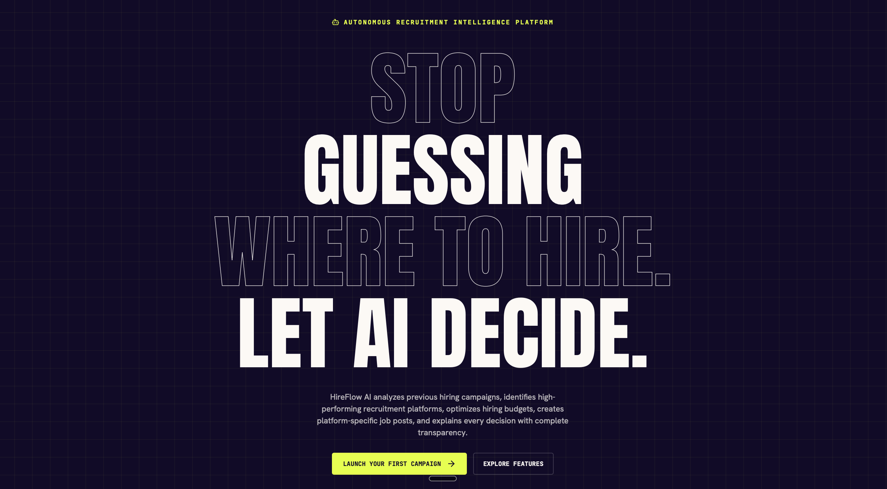
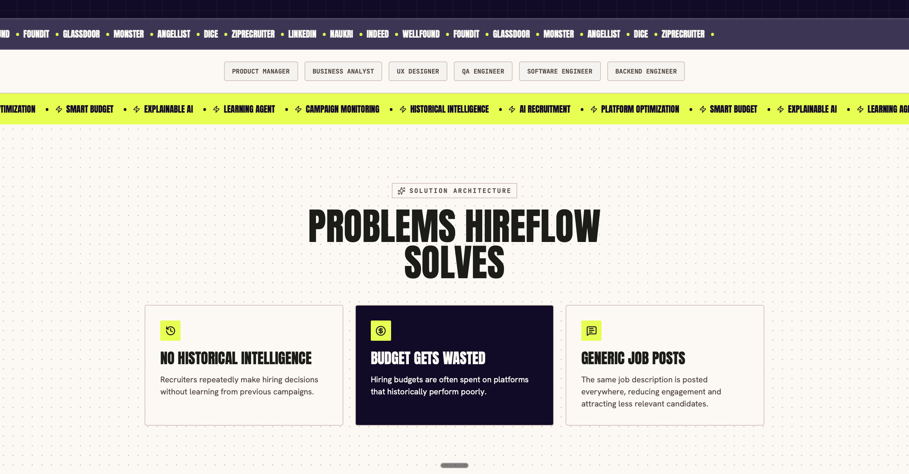
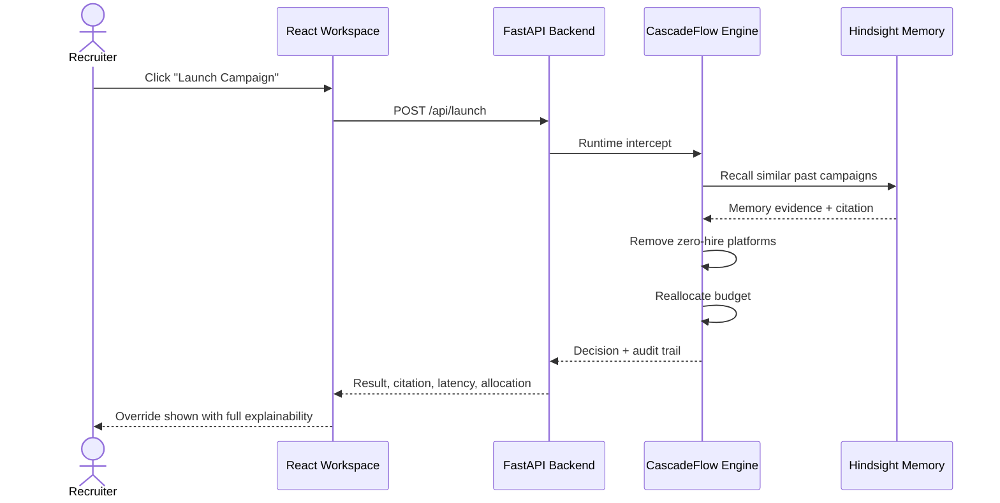
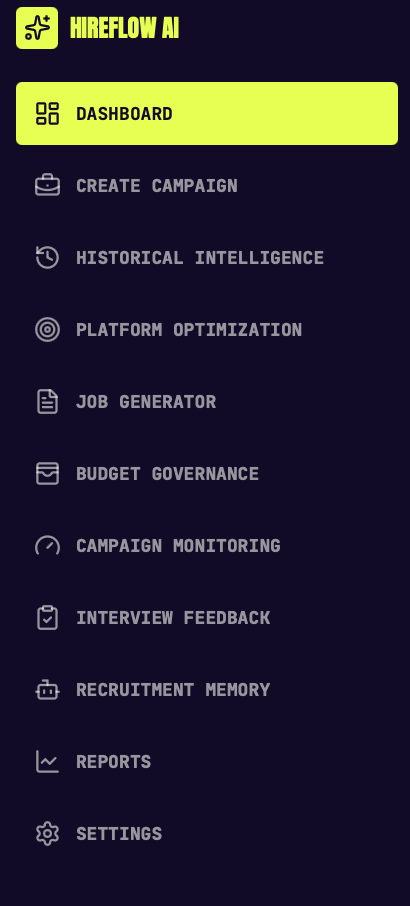
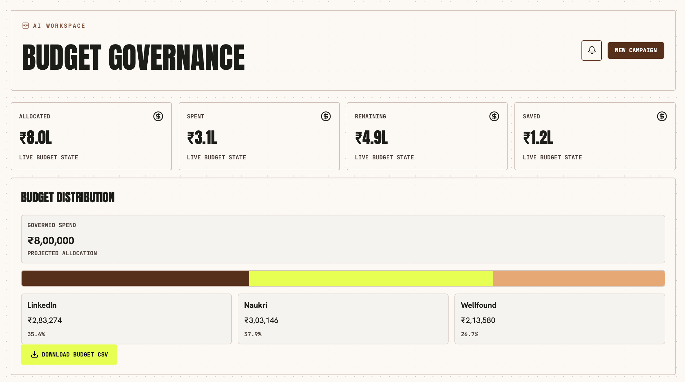
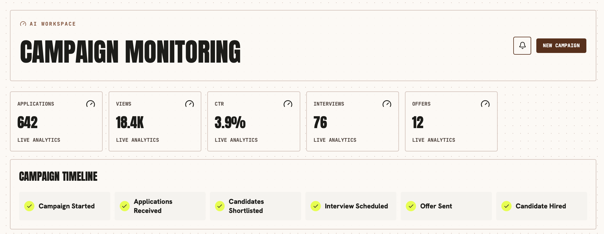
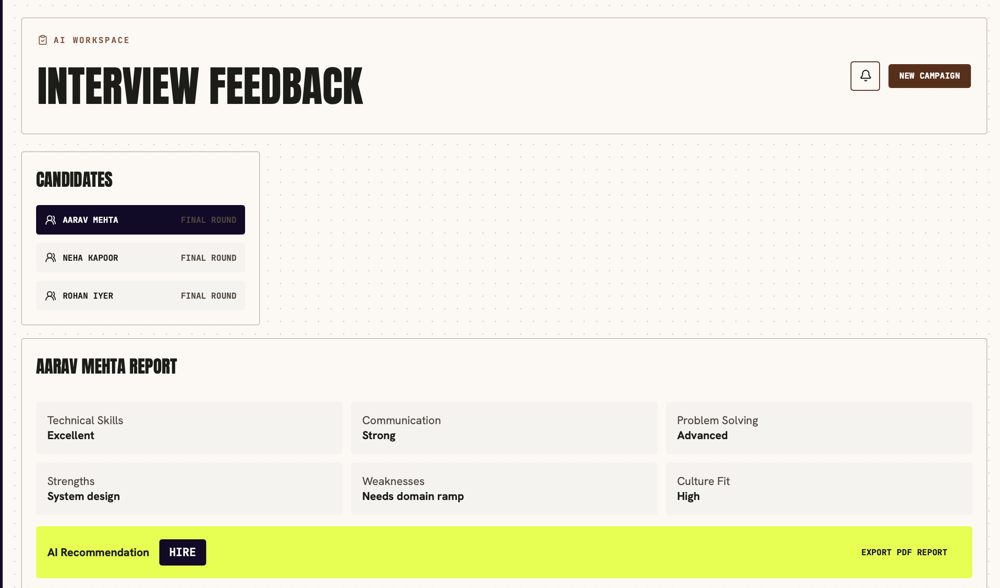
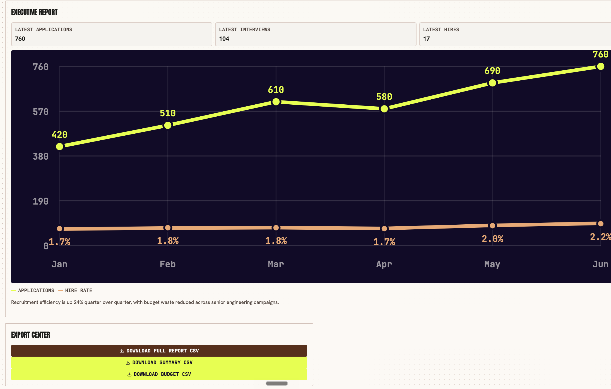
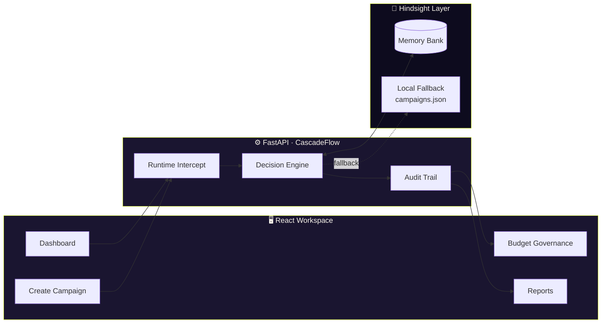

<div align="center">


<br/>

<a href="#-quick-start">

</a>

<br/><br/>


<br/>


</div>

<br/>

<div align="center">

</div>

<br/>

> **HireFlow AI** is a memory-backed recruitment governance system. Recruiters submit a campaign, but **CascadeFlow** intercepts the launch *before* spend is committed. **Hindsight** recalls similar historical campaigns and returns evidence with citations. CascadeFlow removes platforms with spend and zero hires, then reallocates budget — and the UI shows every step of that decision.

<br/>

## 📍 Live Local Links

<div align="center">

| Service | URL |
|---|---|
| 🖥️ Frontend | `http://127.0.0.1:5174/` *(or the port Vite prints)* |
| ⚙️ Backend API | `http://127.0.0.1:8000` |
| 💚 Backend health | `http://127.0.0.1:8000/api/health` |
| 🧠 Backend memory profile | `http://127.0.0.1:8000/api/memory` |
| 🧩 Hindsight API *(optional)* | `http://localhost:8888` |
| 🧩 Hindsight UI *(optional)* | `http://localhost:9999` |

</div>

<br/>

## 🧨 The Problem

<div align="center">

</div>

Recruiting teams keep making the same three mistakes, campaign after campaign:

<table>
<tr>
<td width="33%" valign="top">

### 🕓 No Historical Intelligence
Recruiters repeatedly make hiring decisions without learning from previous campaigns.

</td>
<td width="33%" valign="top">

### 💸 Budget Gets Wasted
Hiring budgets are often spent on platforms that historically perform poorly.

</td>
<td width="33%" valign="top">

### 💬 Generic Job Posts
The same job description is posted everywhere, reducing engagement and attracting less-relevant candidates.

</td>
</tr>
</table>

HireFlow AI fixes all three with one runtime loop: **remember → recall → govern → explain.**

<br/>

## 🧠 How It Works



<details>
<summary><b>📜 See the raw end-to-end runtime flow (text version)</b></summary>

<br/>

```text
User clicks Launch
  → React sends POST /api/launch
  → FastAPI receives campaign payload
  → CascadeFlow runtime intercept logs the request
  → Hindsight recall searches campaign memory
  → Historical memories become structured platform evidence
  → CascadeFlow removes platforms with spend and zero hires
  → Budget is reallocated across retained platforms
  → Backend returns result, citation, audit log, and allocation
  → UI renders override, memory snippet, latency, and audit trail
```

</details>

<br/>

## 🎬 The Core Demo Story

> A recruiter tries to launch a **Senior Backend Engineer** campaign on:
> ```
> LinkedIn, Indeed, Naukri, Wellfound
> ```

HireFlow AI recalls historical campaign memory and finds that **Indeed produced applications but zero hires** for similar backend roles. CascadeFlow intercepts the launch, removes Indeed, reallocates the budget across stronger platforms, and shows the exact memory citation that caused the override.

<table>
<tr>
<th>🚫 Original Plan</th>
<th>✅ CascadeFlow Override</th>
</tr>
<tr>
<td>

```
LinkedIn
Indeed   ← zero hires historically
Naukri
Wellfound
```

</td>
<td>

```
LinkedIn
Naukri
Wellfound
   (Indeed removed,
    budget reallocated)
```

</td>
</tr>
</table>

<br/>

## 🖼️ Inside the Workspace

<div align="center">

<table>
<tr>
<td width="50%" align="center">
<b>Navigation</b><br/><br/>

</td>
<td width="50%" align="center">
<b>Budget Governance</b><br/><br/>

</td>
</tr>
<tr>
<td width="50%" align="center">
<b>Campaign Monitoring</b><br/><br/>

</td>
<td width="50%" align="center">
<b>Interview Feedback</b><br/><br/>

</td>
</tr>
</table>

<br/>

<b>Executive Report</b><br/><br/>


</div>

<br/>

## 🏗️ Architecture



HireFlow AI is a full-stack recruitment campaign demo with four connected layers:

1. **Frontend campaign workspace** — a polished React interface for dashboards, campaign creation, memory setup, platform optimization, budget governance, generated posts, monitoring, and reports.
2. **CascadeFlow runtime governance** — a FastAPI backend intercepts campaign launches, evaluates platform performance, removes historically poor channels, reallocates budget, and returns a structured audit trail.
3. **Hindsight memory layer** — historical campaign outcomes are retained into a memory bank. At launch time, similar campaign memories are recalled and attached as citations. If live Hindsight is unavailable, the app uses a local retained-memory fallback from `backend/data/campaigns.json` so the demo still works reliably.
4. **Visible audit and explainability** — the UI shows the exact backend request path, Hindsight citation, recall source, latency, removed platform, final platform list, budget allocation, and decision audit trail.

<br/>

## 📂 Project Structure

```text
hireflow-integrated/
├── README.md
├── FINAL_HANDOFF.md
├── HINDSIGHT_AUDIT_REPORT.md
├── package.json
├── package-lock.json
├── index.html
│
├── src/
│   ├── main.jsx                  # Full React application
│   ├── styles.css                # All visual styling
│   └── assets/
│       └── hireflow-dashboard.png
│
└── backend/
    ├── __init__.py
    ├── main.py                   # FastAPI entrypoint
    ├── decision_engine.py        # CascadeFlow governance engine
    ├── hindsight_service.py      # Hindsight memory integration
    ├── hindsight_probe.py        # Standalone proof script
    ├── setup_hindsight.py
    ├── requirements.txt
    └── data/
        └── campaigns.json        # Historical campaign dataset
```

<br/>

<details>
<summary><b>📄 Important files — click to expand</b></summary>

<br/>

### `src/main.jsx`
The main React application. Includes the landing page, login/workspace shell, dashboard, campaign creation flow, memory setup panel, backend request preview, runtime decision panel, Hindsight citation display, audit trail rendering, realistic hiring analytics charts, platform performance comparisons, and budget allocation visualization.

```js
fetch(`${API_BASE_URL}/api/memory`)
fetch(`${API_BASE_URL}/api/setup-memory`, { method: "POST" })
fetch(`${API_BASE_URL}/api/launch`, ...)
```

### `src/styles.css`
All visual styling: app shell, dashboard panels, responsive layouts, runtime overlay, memory setup UI, audit trail UI, realistic charts, platform performance bars, budget allocation stack.

### `backend/main.py`
FastAPI application entrypoint.

```text
GET  /
GET  /api/health
GET  /api/memory
POST /api/setup-memory
POST /api/launch
```

The most important endpoint, `POST /api/launch`, performs the full integrated flow:

```text
request → Hindsight recall → CascadeFlow decision → UI response
```

### `backend/hindsight_service.py`
Hindsight memory integration layer. Responsible for loading campaign history, building memory content, initializing the Hindsight client, creating the memory bank, retaining campaign history, recalling relevant memories at runtime, normalizing memory into CascadeFlow-readable platform stats, and providing a local fallback if live Hindsight is unavailable.

```bash
HINDSIGHT_BASE_URL
HINDSIGHT_API_KEY
HINDSIGHT_BANK_ID
```

### `backend/decision_engine.py`
CascadeFlow-style governance engine. Logs the runtime intercept, reads Hindsight-backed platform history, calculates conversion rates and hire efficiency, removes platforms with spend and zero hires, reallocates budget across retained platforms, and returns audit logs with a decision summary.

### `backend/hindsight_probe.py`
Standalone proof script for Hindsight. Tests `create_bank()`, `retain()`, `recall()`, `reflect()`, latency, score threshold, and exact recalled test fact. Use this to prove live Hindsight is actually storing and recalling memory.

### `backend/data/campaigns.json`
Historical campaign dataset, used for Hindsight memory seeding, local fallback recall, platform performance evidence, and demo determinism.

</details>

<br/>

## 🚀 Quick Start

### 1 · Install Frontend Dependencies

```bash
cd hireflow-integrated
npm install
```

### 2 · Set Up the Backend Python Environment

The project uses a Python 3.12 virtualenv at `.venv312/`. If it already exists, use it — otherwise:

```bash
python3.12 -m venv .venv312
.venv312/bin/python -m pip install -r backend/requirements.txt
```

<details>
<summary>Backend requirements</summary>

```text
fastapi
uvicorn
pydantic
python-dotenv
hindsight-client
```

</details>

<br/>

### 3 · Run It — Two Terminals

<table>
<tr>
<th width="50%">🖥️ Terminal 1 — Backend</th>
<th width="50%">🖥️ Terminal 2 — Frontend</th>
</tr>
<tr valign="top">
<td>

```bash
cd hireflow-integrated
npm run dev:backend
```

Expect: `http://127.0.0.1:8000`

```bash
curl http://127.0.0.1:8000/api/health
```

```json
{
  "status": "operational",
  "engine": "CascadeFlow",
  "memory_bank": "hireflow-campaigns"
}
```

</td>
<td>

```bash
cd hireflow-integrated
npm run dev
```

Open the Vite URL, usually:

```
http://127.0.0.1:5174/
```

</td>
</tr>
</table>

<br/>

## 🎯 Demo Walkthrough

<details open>
<summary><b>⚡ Fastest demo path</b></summary>

<br/>

1. Open the frontend.
2. Click **Launch Your First Campaign**.
3. Watch the CascadeFlow Runtime panel open.
4. Confirm that Indeed is removed.
5. Show the Hindsight citation.
6. Show the audit trail.
7. Open the optimization screen to show before/after platforms.

</details>

<details>
<summary><b>🧭 More complete demo path</b></summary>

<br/>

1. Open the frontend and enter the workspace.
2. Go to **Create Campaign**.
3. Review **Step 1: Hindsight Memory Setup**.
4. Click **Retain History**.
5. Review **Step 2: Backend Request Preview**.
6. Click **Launch Through CascadeFlow**.
7. Show the runtime panel.
8. Go to **Historical Intelligence** → show recalled Hindsight evidence.
9. Go to **Recruitment Memory** → show memory lifecycle and latest evidence.
10. Go to **Budget Governance** → show final allocation after override.

</details>

<br/>

### Expected Result

**Input campaign**

```json
{
  "job_title": "Senior Backend Engineer",
  "budget": 800000,
  "platforms": ["LinkedIn", "Indeed", "Naukri", "Wellfound"]
}
```

**Decision:** CascadeFlow removes Indeed, because Hindsight/local memory shows Indeed spent budget on similar backend campaigns but produced zero hires.

**UI shows:**

```text
CascadeFlow overrode the launch
Original Platforms: LinkedIn, Indeed, Naukri, Wellfound
Final Platforms:    LinkedIn, Naukri, Wellfound
Removed:            Indeed
Hindsight Citation:  Campaign ID 2...
Audit Trail:         CASCADEFLOW RUNTIME: DISTRIBUTION INTERCEPTED...
```

<br/>

## 📡 API Reference

<details>
<summary><b><code>GET /api/health</code></b> — backend health check</summary>

<br/>

```bash
curl http://127.0.0.1:8000/api/health
```

</details>

<details>
<summary><b><code>GET /api/memory</code></b> — memory profile from campaign history</summary>

<br/>

```bash
curl http://127.0.0.1:8000/api/memory
```

```json
{
  "bank_id": "hireflow-campaigns",
  "campaign_count": 50,
  "platforms": ["Indeed", "LinkedIn", "Naukri", "Wellfound"],
  "zero_hire_count": 10
}
```

</details>

<details>
<summary><b><code>POST /api/setup-memory</code></b> — retain campaign history into Hindsight</summary>

<br/>

```bash
curl -X POST http://127.0.0.1:8000/api/setup-memory
```

If no Hindsight key is configured, returns local-only mode.

</details>

<details>
<summary><b><code>POST /api/launch</code></b> — run the full runtime decision flow</summary>

<br/>

```bash
curl -X POST http://127.0.0.1:8000/api/launch \
  -H "Content-Type: application/json" \
  -d '{
    "job_title": "Senior Backend Engineer",
    "budget": 800000,
    "platforms": ["LinkedIn", "Indeed", "Naukri", "Wellfound"]
  }'
```

Response includes: selected platforms, removed platforms, budget allocation, model routing, audit log, Hindsight citation, recall latency, runtime path, and request payload.

</details>

<br/>

## 🧩 Hindsight Modes

<table>
<tr>
<th width="33%">1️⃣ Local Fallback</th>
<th width="33%">2️⃣ Hindsight Cloud</th>
<th width="33%">3️⃣ Local Hindsight API</th>
</tr>
<tr valign="top">
<td>

The **default, reliable** demo mode. If no Hindsight API key/service is configured, the app uses `backend/data/campaigns.json`.

Expected source:
```text
local-json
```

</td>
<td>

```bash
export HINDSIGHT_BASE_URL=\
  "https://api.hindsight.vectorize.io"
export HINDSIGHT_API_KEY="your_key"
export HINDSIGHT_BANK_ID=\
  "hireflow-campaigns"
```

Then:
```bash
npm run dev:backend
```

</td>
<td>

```bash
export HINDSIGHT_BASE_URL=\
  "http://localhost:8888"
export HINDSIGHT_BANK_ID=\
  "hireflow-campaigns"
```

If it needs an LLM provider:
```bash
export HINDSIGHT_API_LLM_PROVIDER="grok"
export HINDSIGHT_API_LLM_API_KEY="..."
```

Check:
```bash
curl http://localhost:8888/health
open http://localhost:9999
```

</td>
</tr>
</table>

<br/>

## 🔬 Hindsight Proof Script

```bash
cd hireflow-integrated
.venv312/bin/python backend/hindsight_probe.py
```

The probe stores this exact fact — `Test fact: Grok API verified on 2026-06-28` — then recalls `Grok API verified`.

**Expected success output:**

```text
[HINDSIGHT MEMORY] retain=ok
[HINDSIGHT MEMORY] recall=ok
[HINDSIGHT MEMORY] reflect=ok
```

If Hindsight is not running, the probe will fail with connection refused.

<br/>

## 🪵 Console Logs To Show During Judging

<table>
<tr><th>Browser console</th></tr>
<tr><td>

```text
[HINDSIGHT MEMORY] HINDSIGHT RECALL ACTIVE via POST /api/launch
```

</td></tr>
<tr><th>Backend terminal</th></tr>
<tr><td>

```text
[CascadeFlow] Runtime intercept received {...}
[HINDSIGHT MEMORY] HINDSIGHT RECALL ACTIVE query='Senior Backend Engineer hiring campaign on Indeed' bank_id='hireflow-campaigns'
[Hindsight] recall source=... history=... latency=...ms
```

</td></tr>
</table>

These logs prove the app is not only rendering static UI — the frontend calls the backend, and the backend calls memory **before** governance runs.

<br/>

## 📊 Analytics & Charts

The dashboard charts are not decorative placeholders — they tell the hiring story: monthly applications, interviews, hires, hire rate, platform budget share, qualified hire share, cost per hire, and budget allocation after the CascadeFlow override.

> The charts support the same conclusion as the runtime decision: **some platforms create activity, but not all create hires.**

<br/>

## 🔐 Security Notes

> [!IMPORTANT]
> Never hardcode API keys in source code. Always use environment variables:
> ```bash
> export HINDSIGHT_API_KEY="..."
> export HINDSIGHT_API_LLM_API_KEY="..."
> ```
> The original supplied folders had a hardcoded Hindsight key. This integrated version keeps credentials out of source — intentional, and safer for GitHub submission.

<br/>

## ✅ Current Known Truth

| Level | Behavior |
|---|---|
| **Guaranteed demo** | Works with local `campaigns.json`. Recalls historical campaign evidence, removes Indeed, shows citation and audit trail. |
| **Live Hindsight** | Works only after the Hindsight API is running and configured. Use `backend/hindsight_probe.py` to prove retain/recall/reflect. |

If `curl http://localhost:8888/health` fails, live Hindsight is not running yet.

<br/>

## 🛠️ Troubleshooting

<details>
<summary><b>Frontend says <code>Failed to fetch</code></b></summary>

<br/>

Backend is not running.

```bash
cd hireflow-integrated
npm run dev:backend
```

</details>

<details>
<summary><b>Port 5173 is in use</b></summary>

<br/>

Vite will automatically choose another port, such as `http://127.0.0.1:5174/`. Use whatever URL Vite prints.

</details>

<details>
<summary><b>Hindsight probe cannot connect</b></summary>

<br/>

```bash
curl http://localhost:8888/health
```

If it fails, the Hindsight API is not running.

</details>

<details>
<summary><b>Backend starts but Hindsight source says <code>local-json</code></b></summary>

<br/>

That means live Hindsight is not configured, so the app is using local fallback memory.

```bash
export HINDSIGHT_BASE_URL="http://localhost:8888"
export HINDSIGHT_API_KEY="your_hindsight_key_if_required"
```

Then restart the backend.

</details>

<details>
<summary><b>Python dependency error</b></summary>

<br/>

Use the project virtualenv:

```bash
.venv312/bin/python -m pip install -r backend/requirements.txt
```

</details>

<br/>

## 🏁 Build Check

```bash
npm run build
```

Expected: `✓ built`

<br/>

## 📦 Final Submission Notes

<table>
<tr>
<td width="50%" valign="top">

**✅ Recommended files to highlight**

```text
README.md
FINAL_HANDOFF.md
HINDSIGHT_AUDIT_REPORT.md
backend/main.py
backend/hindsight_service.py
backend/decision_engine.py
backend/hindsight_probe.py
src/main.jsx
src/styles.css
backend/data/campaigns.json
```

</td>
<td width="50%" valign="top">

**🚫 Do not submit**

```text
node_modules/
.venv/
.venv312/
dist/
__pycache__/
```

</td>
</tr>
</table>

<br/>

<div align="center">

## 🎤 Five-Line Pitch

</div>

> HireFlow AI is a memory-backed recruitment governance system.
> Recruiters submit a campaign, but CascadeFlow intercepts the launch before spend is committed.
> Hindsight recalls similar historical campaigns and returns evidence with citations.
> CascadeFlow removes platforms with spend and zero hires, then reallocates budget.
> The UI shows the decision, memory snippet, audit trail, and final budget allocation.

<br/>

<div align="center">


**Built with 🧠 Hindsight + ⚙️ CascadeFlow**

</div>
